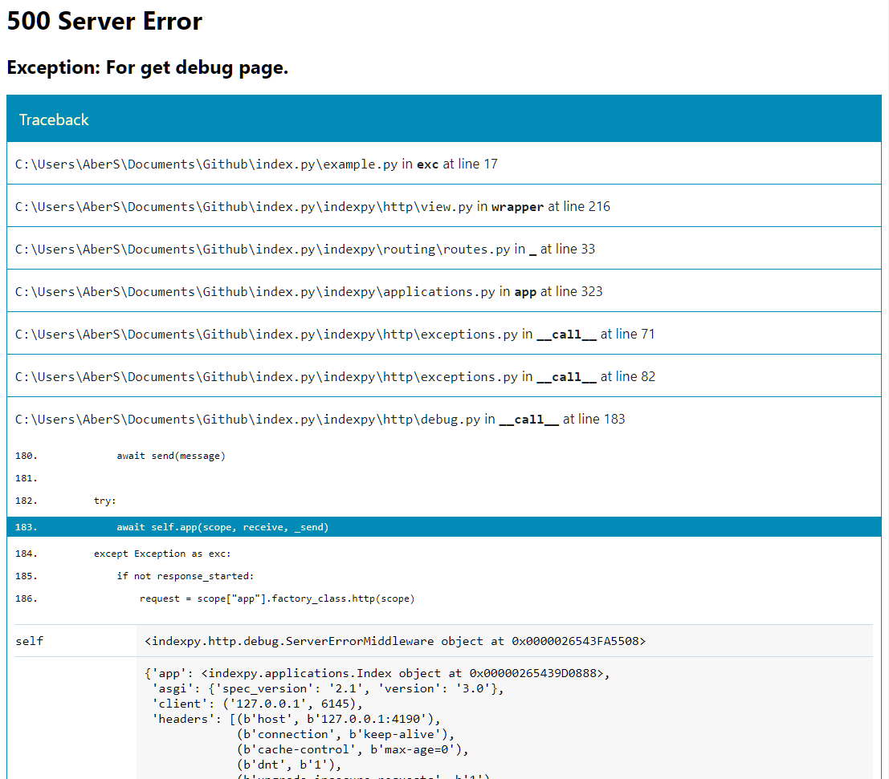

### ENV

**默认值:** `"dev"`

`env` 是一个十分重要的配置，它允许[自动使用对应环境下的配置](./index.md#_3)。

它将读取环境变量里 `INDEX_ENV` 的值，可以但不推荐在配置文件中指定。

### DEBUG

**默认值:** `False`

在环境变量里 `INDEX_DEBUG` 为 `"on"` 或者 `"True"` 时，`DEBUG` 为真；该值同样可以在配置文件中指定。

当 `DEBUG` 为真时，将详细的显示 `500` 错误信息。

### APP

**没有默认值**

`app` 允许自定义 `serve`/`gunicorn` 等命令中的默认 `app`。

### LOG_LEVEL

**默认值:** `"info"`

`log_level` 有五个可用值, 下面是它与 `logging` 的等级对应表

log_level   | logging
---         | ---
"critical"  | logging.CRITICAL
"error"     | logging.ERROR
"warning"   | logging.WARNING
"info"      | logging.INFO
"debug"     | logging.DEBUG

### HOST

**默认值:** `"127.0.0.1"`

`host` 指定 Index 监听的地址。

### PORT

**默认值:** `4190`

`port` 指定 Index 监听的端口。

### ALLOWED_HOSTS

**默认值:** `["*"]`

`allowed_hosts` 用于指定 Index 允许被访问的 HOST。

一些例子:

  1. `["*"]`

    允许所有的 HOST 访问

  2. `["example.com", "*example.com"]`

    允许 example.com 以及 example.com 的子域名访问。

  3. `["example.com", "test.com"]`

    允许 example.com 与 test.com 的访问。

### FORCE_SSL

**默认值:** `False`

`force_ssl` 允许 HTTP/WS 强制跳转到 HTTPS/WSS。

### AUTORELOAD

**默认值:** `True`

`autoreload` 为真时，使用 `index-cli serve` 或 `index-cli gunicorn start` 时，将会监听当前的项目修改，自动重启服务。

### CORS_ALLOW_ORIGINS

**默认值:** `()`

在跨域请求中允许的 ORIGIN 列表。

例如： `['https://example.org', 'https://www.example.org']`

你可以使用 `['*']` 来允许所有的 ORIGIN 值。

### CORS_ALLOW_ORIGIN_REGEX

**默认值:** `None`

需要是一个正则表达式字符串，它将用于匹配在跨域请求中允许的 ORIGIN 。

例如：`'https://.*\.example\.org'`

### CORS_ALLOW_METHODS

**默认值:** `("GET",)`

在跨域请求中允许的 HTTP 请求方法列表。

你可以使用 `['*']` 来允许所有的请求方法。

### CORS_ALLOW_HEADERS

**默认值:** `()`

在跨域请求中允许被使用的 header 列表。

你可以使用 `['*']` 来允许所有的 header。`Accept`、`Accept-Language`、`Content-Language` 和 `Content-Type` 在跨域请求中是默认允许的。

### CORS_ALLOW_CREDENTIALS

**默认值:** `False`

允许在跨域请求中携带 cookies。

### CORS_EXPOSE_HEADERS

**默认值:** `()`

指定可供浏览器访问的任何响应头。

### CORS_MAX_AGE

**默认值:** `600`

设置浏览器缓存 CORS 响应的最长时间（单位：秒）。
